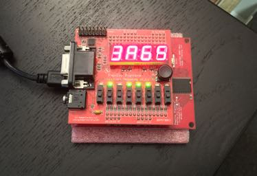
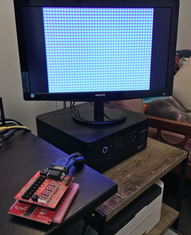

# FPGA Projects

This repo contains a collection of FPGA projects targeting [Papilio Pro](https://papilio.cc/index.php?n=Papilio.PapilioPro) boards, which are based on the [Spartan 6 LX9 FPGA](http://www.xilinx.com/support/documentation/data_sheets/ds160.pdf). The code was written in VHDL using [Xilinx ISE Design Suite 14.7](https://www.xilinx.com/products/design-tools/ise-design-suite/ise-webpack.html) (WebPACK Edition).

These projects are mostly based on [Introducing the Spartan 3E FPGA and VHDL](https://cdn.sparkfun.com/datasheets/Dev/FPGA/IntroToSpartanFPGABook.pdf) from [SparkFun](https://www.sparkfun.com/).

## Flashy Lights

The project under [flashy_lights](./flashy_lights) uses the LEDs on the [LogicStart MegaWing](https://papilio.cc/index.php?n=Papilio.LogicStartMegaWing) to display a sequence of patterns that are read from block RAM (configured as a single port ROM). It uses a simple counter to loop over addresses in the ROM. At each address a pattern of eight bits determines which LEDs are switched on.

The ROM can found in [flashy.coe](./flashy_lights/flashy.coe).

## Segment Counter

The project under [segment_counter](./segment_counter) uses the seven-segment display on the LogicStart MegaWing to display a hexadecimal counter. The segment_counter module uses a 36-bit counter, which is incremented on the rising edge of the clock signal. Bits 35-20 are shown on the seven segment display, with bits 35-28 also mapped onto the LEDs.

Although a video might be more helpful, here is a photo of _Segment Counter_:

Note that the order of the LEDs is backwards from this perspective. 

## Simple VGA

The project under [simple_vga](./simple_vga) uses the VGA port on the LogicStart MegaWing to output a checkboard signal. Probably the most interesting part of this project is that it uses a Clock Divider IP Core to convert the board's 32Mhz clock signal to 25.125Mhz, which is required to generate a VGA signal.

Here is a photo of _Simple VGA_ in action:

## References

* [Free-Range VHDL](http://freerangefactory.org/pdf/df344hdh4h8kjfh3500ft2/free_range_vhdl.pdf) from [Free Range Factory](http://freerangefactory.org)
* [Introducing the Spartan 3E FPGA and VHDL](https://cdn.sparkfun.com/datasheets/Dev/FPGA/IntroToSpartanFPGABook.pdf) from [SparkFun](https://www.sparkfun.com/)
