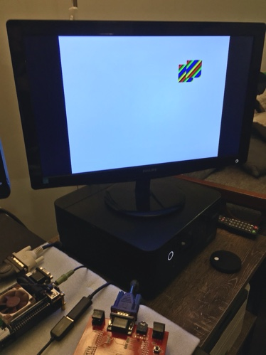

# FPGA Basics

This repo contains a collection of FPGA projects targeting [Papilio Pro](https://papilio.cc/index.php?n=Papilio.PapilioPro) boards, which are based on the [Spartan 6 LX9 FPGA](http://www.xilinx.com/support/documentation/data_sheets/ds160.pdf). The code was written in VHDL using [Xilinx ISE Design Suite 14.7](https://www.xilinx.com/products/design-tools/ise-design-suite/ise-webpack.html) (WebPACK Edition).

These projects are mostly based on [Introducing the Spartan 3E FPGA and VHDL](https://cdn.sparkfun.com/datasheets/Dev/FPGA/IntroToSpartanFPGABook.pdf) from [SparkFun](https://www.sparkfun.com/). Projects are listed in chronological order, based on when I completed them.

## Flashy Lights

The project under [flashy_lights](./flashy_lights) uses the LEDs on the [LogicStart MegaWing](https://papilio.cc/index.php?n=Papilio.LogicStartMegaWing) to display a sequence of patterns that are read from block RAM (configured as a single port ROM). It uses a simple counter to loop over addresses in the ROM. At each address a pattern of eight bits determines which LEDs are switched on.

The ROM can found in [flashy.coe](./flashy_lights/flashy.coe).
c
## Segment Counter

The project under [segment_counter](./segment_counter) uses the seven-segment display on the LogicStart MegaWing to display a hexadecimal counter. The segment_counter module uses a 36-bit counter, which is incremented on the rising edge of the clock signal. Bits 35-20 are shown on the seven segment display, with bits 35-28 also mapped onto the LEDs.

Although a video might be more helpful, here is a photo of _Segment Counter_:

Note that the order of the LEDs is backwards from this perspective.

## Segment Counter with Input

This project is an extension of _Segment Counter_. [segment_counter_input](./segment_counter_input) changes the behaviour of the counter so that it only changes when the joystick is being pushed left or right. When it is pushed to the left, the counter decrements, and when pushed to the right, the counter increments. The counter can be reset by pressing the joystick button for a moment.

The LEDs have also been changed to indicate which input has been registered.

## Simple VGA

The project under [simple_vga](./simple_vga) uses the VGA port on the LogicStart MegaWing to output a checkboard signal. Probably the most interesting part of this project is that it uses a Clock Divider IP Core to convert the board's 32MHz clock signal to 25.125MHz, which is required to generate a 640x480 VGA signal.

Here is a photo of _Simple VGA_ in action:

## VGA Crosshair

Building on _Simple VGA_, the [vga_crosshair](./vga_crosshair) project displays two intersecting lines. The crosshair, or point of intersection, can be moved using the joystick. Movement is performed on the rising edge of the VSYNC signal, to avoid tearing.

90% of the way towards a playable first-person shooter, right?

## Audio Wave

The project under [audio_wave](./audio_wave) uses the 3.5mm audio jack on the LogicStart MegaWing to output audio, using a sine wave stored in Block RAM. The sine wave data is stored in [sine.coe](./audio_wave/sine.coe), and contains 1024 8-bit values. The main module relies on a module called [dac8](./audio_wave/dac8.vhd), which implements a Delta-Sigma DAC as per [Xilinx App Note 154](https://www.xilinx.com/support/documentation/application_notes/xapp154.pdf).

A small C program has also been included, for generating sine wave data. This can be found in [sine.c](./audio_wave/sine.c).

The tone that is played is approximately 488hz. The clock is ~32mhz, and we use the highest 10 bits of a 16 bit counter to choose which sample to read from memory. So 32,000,000 / 2^6 = 500,000 samples per second. We have 1024 samples, and frequency is the number of times we can play all of those samples per second. In this case it is 500,000 / 1024 = 488.28125.

It sounds like [this](https://www.youtube.com/watch?v=E3Mmov-nYok).

## Volume Control

[volume_control](./volume_control) builds on _Audio Wave_ by adding a volume control, with 16 levels of volume. It does this using a multiplier IP block which multiplies a 4-bit volume signal with the sample that is currently being played. The lowest 4 bits of the product are discarded, and the highest 8 bits are played.

The volume can be controlled using the joystick on the MegaWing, and is displayed as a hexadecimal value on the seven segment display.

## Volume Control 16

[volume_control_16](./volume_control_16) is a simple iteration on _Volume Control_ that uses a 16-bit DAC instead of an 8-bit DAC. The code for generating a COE file has been updated accordingly, in [sine16.c](./volume_control_16/sine16.c).

## Gamepad Test

I finally got my hands on an [Arcade MegaWing](http://papilio.cc/index.php?n=Papilio.ArcadeMegaWing). This improves on the standard MegaWing by adding support for 4096-colour VGA, as well as various inputs. [gamepad_test](./gamepad_test) builds upon the _VGA Crosshair_ example, adding support for a Sega Mega Drive gamepad. It also makes the necessary adjustments to work with the updated VGA output.

Here it is in action:

Input/output pins were be updated to match the new wing, and wiring for a ground pin was added for the controller.

## Bitmap Display

[bitmap_display](./bitmap_display) builds on _Simple VGA_ by allowing a small bitmap/sprite to be drawn from Block RAM. The image to be drawn is in [dither.coe](./bitmap_display/dither.coe), and a program for generating the COE file can be found in [dither.c](./bitmap_display/dither.c).

It's difficult to tell from the photo that this is a pure bitmap image (i.e. ones and zeros), so the darker triangles are actually dithered:

This turned out to be more sensitive to timing than I expected. The bitmap is read from Block RAM one row at a time, and it was necessary to update the read address earlier enough to ensure that the output would be available in time to be drawn. Failing to do this caused pixel alignment issues.

The next challenge is full colour support...

## Full Colour

The [full_colour](./full_colour) project takes advantage of the 4096-bit colour output of the Arcade MegaWing. Like the _Bitmap Display_ project, it draws a small sprite from Block RAM. However, there are two changes to how the sprite is drawn. The first is that the data is stored per-pixel, rather than per-row. The second is that each pixel contains 12 bits of colour data (4 bits per channel). The image to be drawn is in [gradient.coe](./full_colour/gradient.coe), and a program for generating the COE file can be found in [gradient.c](./full_colour/gradient.c).

To make things more interesting, the image is drawn twice, resulting in two separate sprites that bounce around the screen:

This was achieved by converting the single port ROM into a dual port ROM, allowing two memory locations to be read on each clock cycle.

## RS-232 Receiver

The [rs232_receiver] project is based on Hamster's response in [this post](http://forum.gadgetfactory.net/topic/1823-usb-specifics-for-the-pro/) on the [Gadget Factory Forum](http://forum.gadgetfactory.net/). It allows the LEDs on the LogicStart MegaWing to be controlled via the USB serial interface, using the RS-232 protocol. A simple oversampling approach is used to handle incoming data.

On my Linux machine, I was able to connect to the device `/dev/ttyUSB1` with both `minicom` and `screen`, using a baud rate of 9600. Any keyboard input is sent to the FPGA, and used to control LEDs.

Using `minicom`, you will need to configure the serial port like so:

    +-----------------------------------------------------------------------+
    | A -    Serial Device      : /dev/ttyUSB1                              |
    | B - Lockfile Location     : /var/lock                                 |
    | C -   Callin Program      :                                           |
    | D -  Callout Program      :                                           |
    | E -    Bps/Par/Bits       : 9600 8N1                                  |
    | F - Hardware Flow Control : No                                        |
    | G - Software Flow Control : No                                        |
    |                                                                       |
    |    Change which setting?                                              |
    +-----------------------------------------------------------------------+

For `screen`, you can use:

    screen /dev/ttyUSB1 9600

You may need to run these via `sudo`.

On Windows, you can use a terminal emulator such as [putty](https://www.putty.org).

## References

* [Free-Range VHDL](http://freerangefactory.org/pdf/df344hdh4h8kjfh3500ft2/free_range_vhdl.pdf) from [Free Range Factory](http://freerangefactory.org)
* [Introducing the Spartan 3E FPGA and VHDL](https://cdn.sparkfun.com/datasheets/Dev/FPGA/IntroToSpartanFPGABook.pdf) from [SparkFun](https://www.sparkfun.com/)
* [ISE In-Depth Tutorial](https://www.xilinx.com/support/documentation/sw_manuals/xilinx13_3/ise_tutorial_ug695.pdf) from Xilinx
